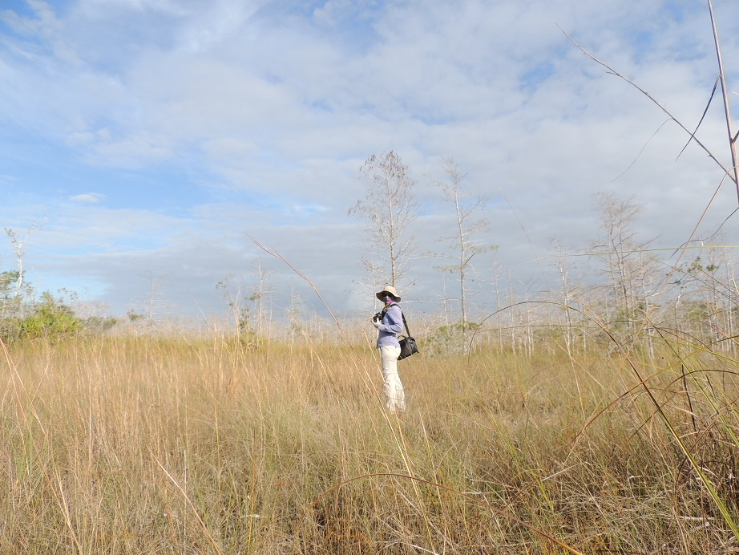

# Species profile:

<div class = "row">
<div class = "col-md-6">

Kara Tyler-Julian is an entomologist with a passion for the environment. She has a Bachelor of Arts in Biological Psychology from the New College of Florida and a Master of Science in Entomology (specializing in Integrated Pest Management) from the University of Florida. She has academic and professional experience working with a variety of living organisms ranging from plants and insects to fish, birds, reptiles and even manatees. Her published research includes subjects as diverse as lateralization in manatees, thrips in Spanish Moss, and an organic push-pull method of managing thrips and tospoviruses on tomatoes and peppers. She is currently employed as the Field Validation Biologist for Lee County Mosquito Control maintaining the mosquito and Gambusia colonies, and conducting experiments to verify the efficacy of different mosquito control products. In her personal time she enjoys educating the public on various topics including native insects, native plants, sustainable gardening techniques and more. She has given presentations to garden clubs, plant societies, non-profit organizations and at public libraries. She practices what she preaches by ensuring that every aspect of her own personal life is as environmentally-sustainable as she encourages others to be. She lives with her [husband](https://swampthingpaul.github.io/) and adopted pets (2 dogs, 5 parrots, 1 tortoise) in a solar-powered house on a 0.75 acre lot with mostly preserved native Florida plants and a burgeoning food forest.

<br>

<center></center>

</div>

<div class = "col-md-6">

<center></center>


<br>

<center></center>

<br>

<center></center>

</div>


<!--
## Work In Progress

But for the time being here is a little about myself. 

Kara Tyler-Julian is an entomologist with a passion for the environment. She has a Bachelor of Arts in Biological Psychology from the New College of Florida and a Master of Science in Entomology (specializing in Integrated Pest Management) from the University of Florida. She has academic and professional experience working with a variety of living organisms ranging from plants and insects to fish, birds, reptiles and even manatees. Her published research includes subjects as diverse as lateralization in manatees, thrips in Spanish Moss, and an organic push-pull method of managing thrips and tospoviruses on tomatoes and peppers. She is currently employed as the Field Validation Biologist for Lee County Mosquito Control maintaining the mosquito and Gambusia colonies, and conducting experiments to verify the efficacy of different mosquito control products. In her personal time she enjoys educating the public on various topics including native insects, native plants, sustainable gardening techniques and more. She has given presentations to garden clubs, plant societies, non-profit organizations and at public libraries. She practices what she preaches by ensuring that every aspect of her own personal life is as environmentally-sustainable as she encourages others to be. She lives with her [husband](https://swampthingpaul.github.io/) and adopted pets (2 dogs, 5 parrots, 1 tortoise) in a solar-powered house on a 0.75 acre lot with mostly preserved native Florida plants and a burgeoning food forest.

```{r, out.width="50%",fig.align="center",echo=FALSE}
knitr::include_graphics("https://farm5.staticflickr.com/4557/24850423408_7824ce5445_h.jpg")
```
-->
***