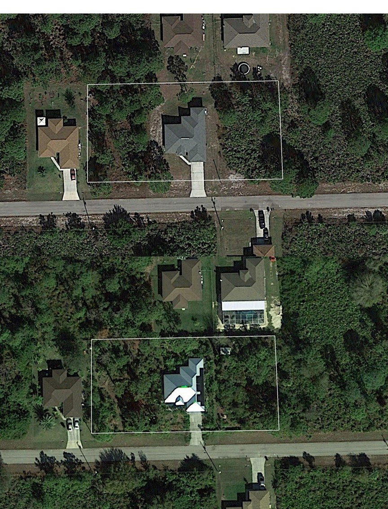
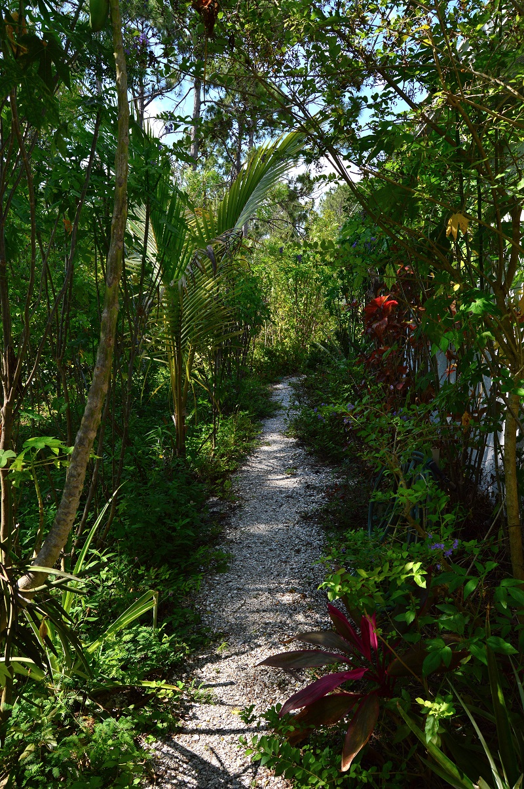
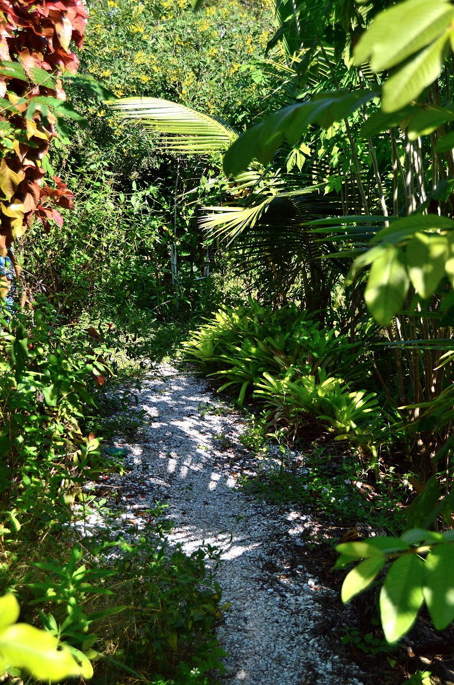
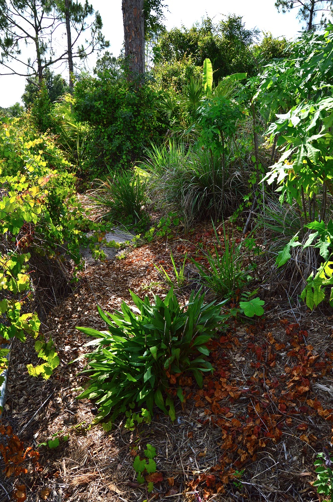
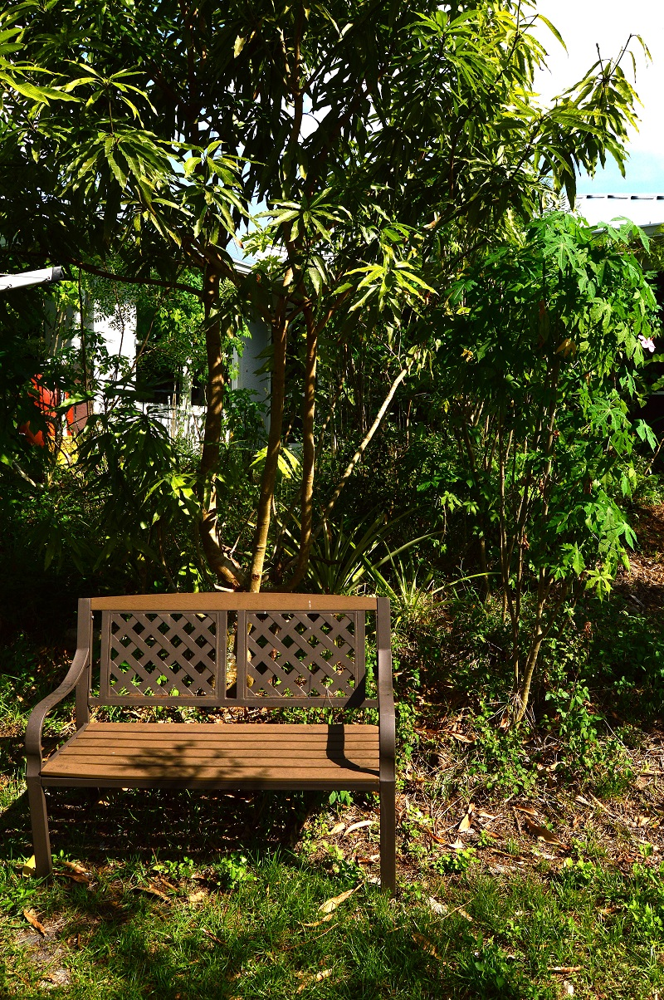
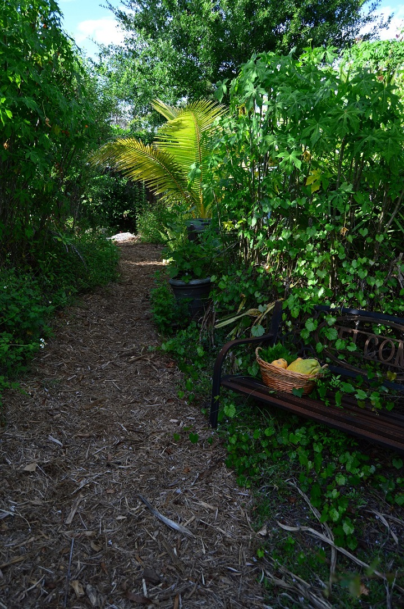
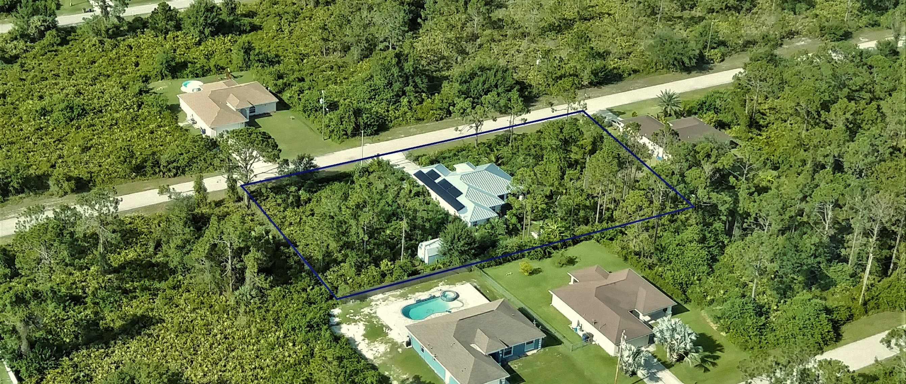

 - [**The Forest through the trees**](#story)
 - [**How did we get here?**](#process)

<br>
<a name="story"></a>

## The Forest through the trees

In August of 2013 we purchased and moved into our first home in Lehigh Acres, Florida which was in great condition except for the yard. The yard needed a lot of work which an Entomologist and Soil Scientist were more than equipped for. It was a typical 0.25 acre suburban lot in South West Florida, built 4 feet off the ground on a mound of awful fill dirt. The lot had been initially planted with standard sod, and 6 years of neglect had taken its toll. By the time we bought the house it was unhealthy grass and weeds with many patches of eroded naked sand. We had our work cut out for us.

```{r, out.width="50%",fig.align="center",echo=FALSE,fig.cap="Top is aerial imagery from January 2013 and bottom is imagery from January 2019."}

```


Flash forward to now and when people come by to visit, they are astounded. We hear similar comments from visitors, “It’s a jungle!”, “I feel like I’m at a botanical garden”, “Did you plant all these plants” “There are so many trails, who did all this?” “There are so many different kinds of plants and trees here!”. Our yard has gone from a barren suburban lawn to a lush wildlife-friendly food forest. All year-round there is something to harvest and eat from the yard. Birds, rabbits, snakes, and gopher tortoises have made their homes in our yard, and butterflies and other insects are abundant. We planted food for ourselves and for the wildlife.

<br>
<div class = "row">
<div class = "col-md-4">
<center></center>
</div>
<div class = "col-md-4">
<center></center>
</div>
<div class = "col-md-4">
<center></center>
</div>
</div>
<br>

We did all the work, planted all the plants and made all the trails, there are many diverse species of plants and we are always adding more. The main thing we want everyone to take away from this garden is that they can do this too. Anyone can turn a broken suburban lawn into a rich food forest and/or wildlife habitat that requires less maintenance than a traditional lawn. It doesn’t take magic or special skills, just time and motivation.

<br>
<div class = "row">
<div class = "col-md-6">
<center></center>
</div>
<div class = "col-md-6">
<center></center>
</div>
</div>
<br>

We eventually purchased the lots on either side of us to bring our land up to 0.75 acre. The two extra lots have been preserved as much as possible with native plants and wildlife. We added a few fruit trees here and there but mostly we just maintain the native flora on those lots. After Irma damaged our roof necessitating a new roof, we had a metal roof put on followed by 24 solar panels. As environmentalists it was time we put our money where our mouths were and so we did.

As time progresses our food forest/wildlife garden is ever changing. Trees grow and mature and the plants growing around and under them change in size and species composition as the understory adjusts to the new light and growing conditions. We move plants around accordingly, adding new shade-tolerant plants where there didn’t used to be shade and moving sun-loving plants to the open areas. Nature, too, adjusts our forest. Freezes, record heat, flood events, and wind events such as Hurricane Irma are constantly changing our landscape. One cannot fight nature; one must simply go with the flow and plant trees where the wind blows them.

Something we always try to stress to people who feel overwhelmed by the scope of our garden is that there is no magical “green thumb”. Our goal is to help others see what they can achieve and to advise them as to how. As an entomologist and a soil scientist we have a lot of knowledge on how to deal with pest and soil issues, but the main explanation for our success is persistence and experimenting. We are constantly learning by experience and researching online to see what others have learned. Many, many plants have died in this yard, or been moved to a different spot, or killed. We have learned to do copious research before buying and planting a plant and have learned to plant the right plant in the right place with the right technique to ensure success. It took us five years just to finally perfect our initial planting technique, but we are happy to teach these techniques to others so they can get it right the first time!

```{r, out.width="80%",fig.align="center",echo=FALSE}

```

<br>
<a name="process"></a>

## How did we get here?

<br>
<div class = "row">
<div class = "col-md-6">

**Step 1. Contain the rain:** The first thing we did when we moved in was to install gutters on the house to stop the erosive effects of the rain and save what was left of the sand/foundation. Next, we set to planting. In time we installed 4 rain barrels to capture rain water for watering plants in the dry season. 


**Step 2. It all starts with soil:**  To have healthy plants you need to have healthy soil. There are many native Florida plants that will grow well in our poor sandy soil, but to grow a wider variety of plants and to keep a good nutrient equilibrium it is a good idea to add organic matter to the soil. We did this in a wide variety of ways when we moved in. We made and purchased compost to add to the soil. We got all the free mulch we could and put mulch all around. We picked up piles of logs from the side of the road and brought them home to rot in the yard adding more organic matter. We used cardboard boxes, newspapers and junk mail as weed barriers. When we pulled weeds we left them on the ground to decompose. Years of adding copious amounts of organic matter has resulted in a richer, healthier soil which supports microbial processes, retains nutrients and retains moisture.

**Step 3: Plant, plant, plant!:**  They say the best time to plant a tree is 20 years ago. Without a time machine the second best time is NOW! As soon as we could get our hands on plants we started planting them all around the yard. Free plants were the best as we were on a budget so we ended up with a lot of non-native plants at first. Over the years as we learned more and had more money to spend on plants, we started to add more native plants and fruit trees. Native plants are great for attracting pollinators, beneficial insects, birds, and other wildlife to the yard while providing beautiful plants that require very little attention. Fruit trees are to grow food for ourselves. The yard is part permaculture food forest and part wildlife habitat. We always garden with insects (and other creatures) in mind.

**Step 4: Maintain:** Once the erosion was under control, rain barrels installed, soil health was improved, and plants were planted we went into maintenance mode. We still add more plants all the time because it becomes addicting to find a new plant and add it to the yard. However, most of our gardening time is spent maintaining current plants. With a food forest/native habitat maintenance is very different from a lawn. Our time is not spent mowing, fertilizing and watering. Instead maintenance consists of occasional pruning, hand-weeding, and once a year refreshing the mulch. That’s about it. When we plant new plants and are getting them established, we water them daily or weekly with water from the rain barrels. Once established the plants don’t need any help from us! It’s all about planting the right plant in the right place with the right method.

**Step 5: Share the wealth:** This is where you come in! Now that our yard is in maintenance mode, it is time for us to share our knowledge and planting materials (cuttings and seeds) with people who want to transition their yard as well. We also are happy to show people around our yard so they can envision how their own yard and all the different plants can look. It all starts with 1 plant at a time and eventually snowballs into an entire yard transforming into a beautiful forest. The more yards that transition to wildlife habitat and food forests, the more we can help the environment, the wildlife, and ourselves.

Why should you think about getting rid of your lawn and planting trees, shrubs and native flowers instead? There are many benefits including: using less water and pesticides, saving on your energy bill by shading your house, providing habitat for wildlife, not spending money or time mowing, fewer emissions due to a lack of using gas-powered lawn equipment, having a more pleasing landscape, sequestering more carbon, and many more benefits. Check out the [“Learn More”](https://karatylerjulian.github.io/links.html){target="_blank"} section of this website for more information on “greening” your yard.

We welcome visitors to see our property and provide cuttings and seeds to help get them started. Politicians won’t save the planet from climate change and development; we must do it ourselves and it all starts with a seed!

<center></center>

</div>
<div class = "col-md-6">

<center></center>
<center></center>
<center></center>
<center></center>
<center></center>
<center></center>
</div>
</div>

***