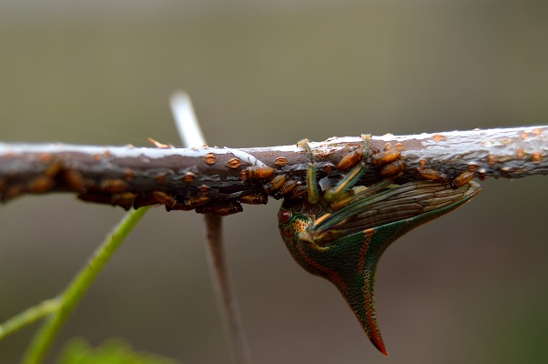

```{r, out.width="50%",fig.align="center",echo=FALSE}

```

I am an entomologist with a passion for the environment.

Officially I have a B.A. in Biological Psychology from New College of Florida where my studies emphasized animal behavior while working with fish, birds, and manatees, and a M.S. in Entomology from the University of Florida where my studies concentrated on Integrated Pest Management, specifically of thrips in agricultural row crops. 

I have always had a connection to nature from an early age and continue to purse my passion of the natural world.

This website will host some general information about myself, my interests, publications and presentations.


```{r, out.width="50%",fig.align="center",echo=FALSE}
knitr::include_graphics("images/mantid.jpg")
```

****

Webpage developed using [rmarkdown website template](https://github.com/privefl/rmarkdown-website-template){target="_blank"} developed by [privefl](https://github.com/privefl){target="_blank"}