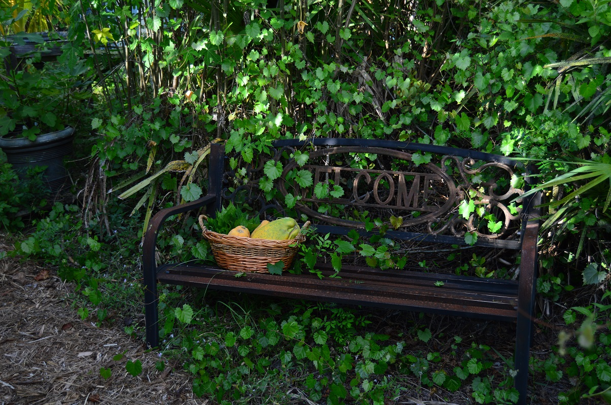
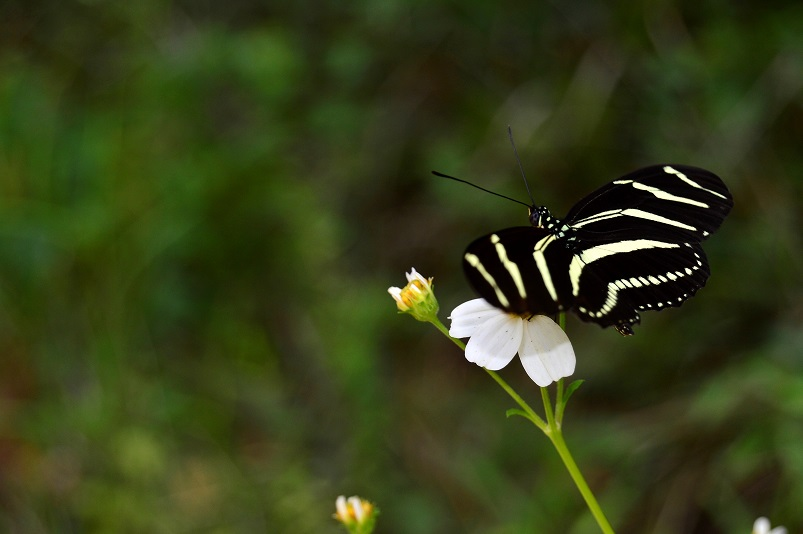

<!--

-->

 
If you are looking for information about Kara Tyler-Julian and her freelance educational work, you have come to the right place. Have a look around and send me a message if you wish. Are you looking to learn about native plants, food forests, insects, or a combination of those topics? Check out my [presentation](https://karatylerjulian.github.io/presentations.html){target="_blank"} page to see the topics I am knowledgeable in and [contact me](https://karatylerjulian.github.io/contactme.html){target="_blank"} for more information.

Thank you for visiting!

 

 

****

Webpage developed using [rmarkdown website template](https://github.com/privefl/rmarkdown-website-template){target="_blank"} developed by [privefl](https://github.com/privefl){target="_blank"}