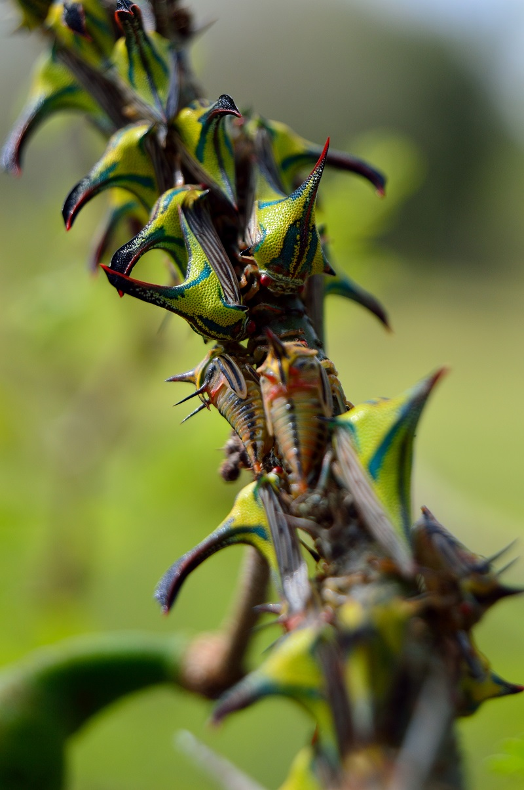
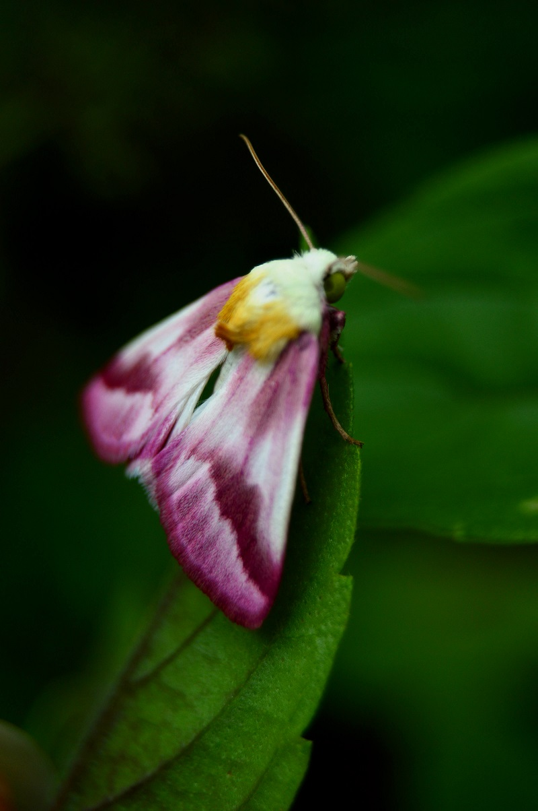

As an entomologist I also enjoy amateur macrophotography. Being able to capture a beautiful, still image of an insect in great detail allows me to pull up the photos on the computer later and identify my new finds without having to capture, euthanize, and examine them later as many entomologists do. While I’m out snapping photos of insects I have also enjoyed photographing and identifying the plants around me as well. My photographs can be found on my [Flickr](https://flic.kr/ps/2pEUsP){target="_blank"} page and are a great educational tool. By browsing the photos you can see many of the native insects and plants that we can find right here in Southwest Florida.

 

 

 

 
 

***